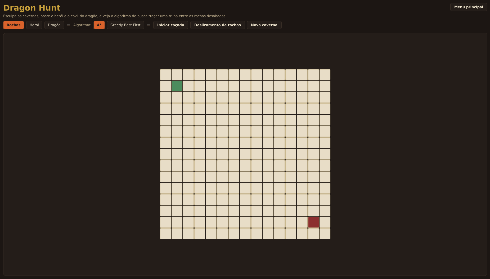
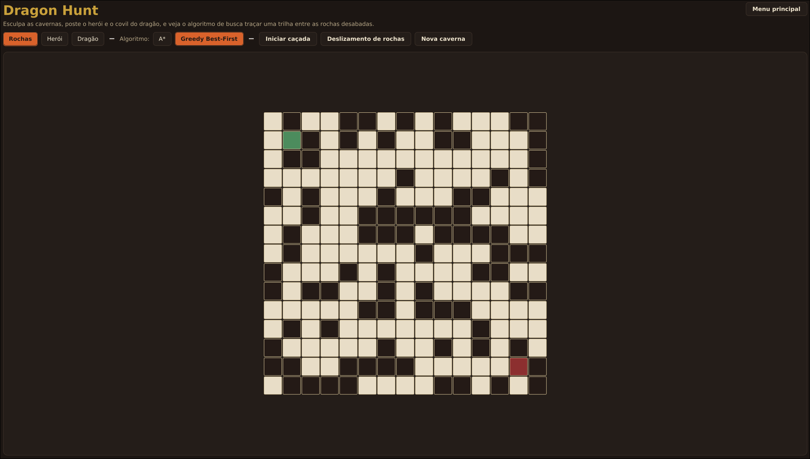
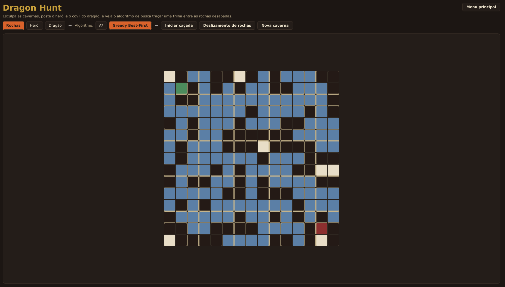
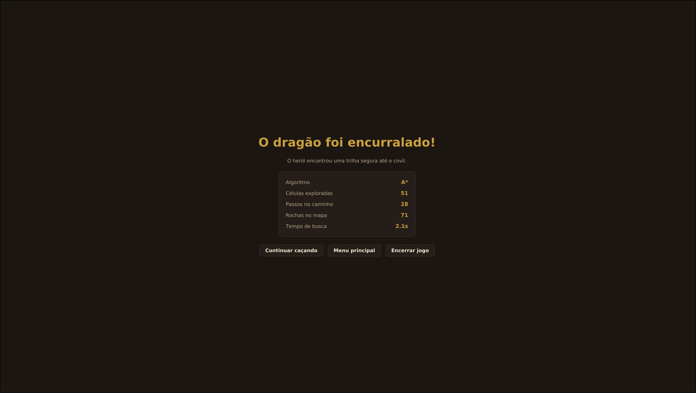
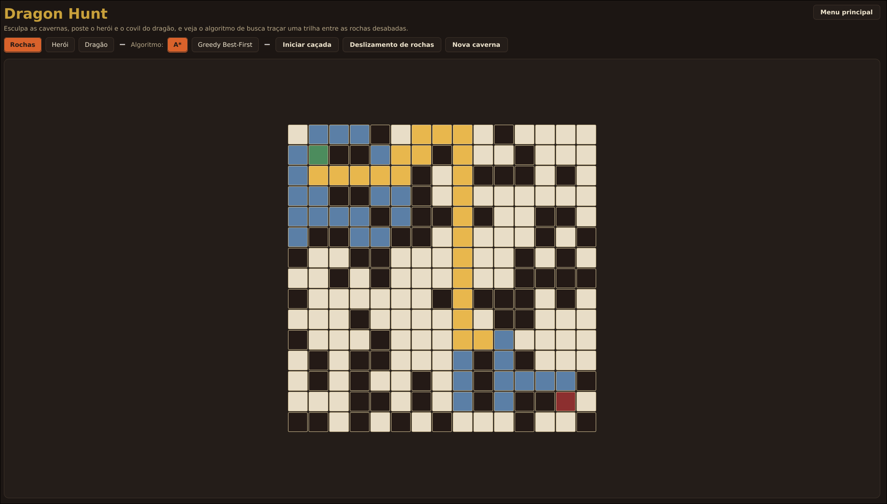

# Dragon Hunt

O Dragon Hunt é um projeto da disciplina de estrutura de dados não lienares, onde iremos construir um programa que demonstre
a superioridade do algoritmo A* ( A-start ) sobre o algoritmo Busca Gulosa (Greedy Best-First Search). Para isso o programa irá criar um
labirinto com dois personagens representando cada algoritmo, o A* irá representar o dragão e vai persiguir o algoritmo de Busca Gulosa, que por sua vez será o cavaleiro.

# Requisitos

- O programa deve ter interface gráfica
- O programa deve possibilitar a criação aleatôrio dos labirintos
- O programa deve possibilitar que o usuário desenhe o próprio labirinto
- O programa deve possibilitar a geração aleatório do ponto inicial de cada personagem no labirinto
- O programa deve possibilitar que o usuário possa definir o ponto inicial de cada personagem no labirinto
- O programa deve possibilitar que o usuário possa testar os algoritmos do Gulos e do A* individualmente
- O programa deve possibilitar a inversão da caçada, onde o caçador vira caça

**Implemetações extras**

- O programa deve permitir adicionar mais cavaleiros ou dragões no labirinto
- O labirinto deve conter paredes que transportam o dragão ou o cavaleiro para o outro lado do labirinto.
- O programa deve ter musica de fundo

# Imagens do Labirinto

Abaixo estão algumas imagens da interface e dos diferentes estados do labirinto durante a execução do Dragon Hunt.

 
  
  

 

  
  

 

  

